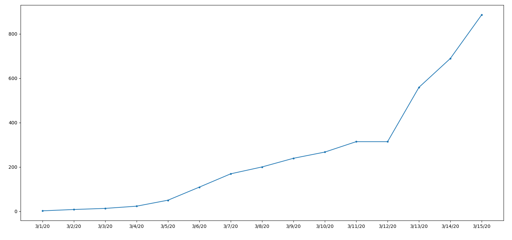

# COVID-19 Belgium
**Simple python plot of the COVID-19 confirmed cases in Belgium over time using the [API by ExpDev](https://github.com/ExpDev07/coronavirus-tracker-api).**
This project generates a plot like this one:


# Installation
```bash
pip install -r requirements.txt
python main.py
```
# API used
Uses [coronavirus-tracker-api](https://github.com/ExpDev07/coronavirus-tracker-api) by ExpDev07. This external dependency is licensed as:
```
The data is available to the public strictly for educational and academic research purposes. Please link to this repo somewhere in your project if you can (not required) :).
```

Data should should come from [the Johns Hopkins University Center for Systems Science and Engineering (JHU CSSE)](https://github.com/CSSEGISandData/COVID-19).
